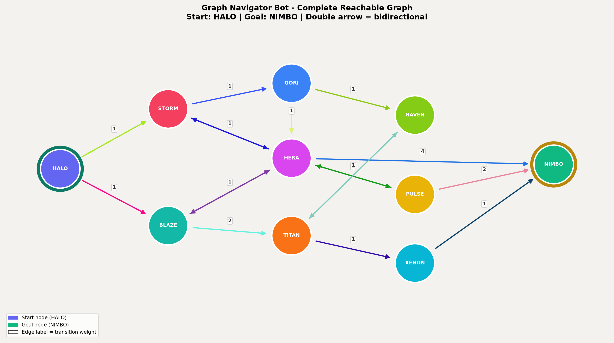

# Task 1 & 2
# User Manual: Image Modification Using Google Gemini AI

This step-by-step user manual guides you through the process of setting up a Google Gemini account and utilizing its native AI image-editing capabilities to seamlessly add a single wild dog to an existing landscape.

---

## Part 1: Accessing Google Gemini

To use Gemini's image editing features, you need to sign in with a Google Account. Follow these steps to access the platform.

### Step 1.1: Navigate to the Platform
* Open your web browser and go to [gemini.google.com](https://gemini.google.com).
* Click on the **"Sign in"** or **"Chat with Gemini"** button located in the center or upper-right corner of the page.

### Step 1.2: Authenticate Your Account
* Enter your Google email address (Gmail) and click **Next**.
* Enter your secure password to complete the authentication. 
* *Note: If you do not have a Google account, click "Create account" at the bottom left of the sign-in card and follow the quick setup steps.*

### Step 1.3: Enter the Conversational Workspace
* After signing in, you will be automatically redirected to the main Gemini conversational dashboard. You are now ready to begin editing.

---

## Part 2: Implementing the Task (Adding the Wild Dog)

With your workspace active, you can now upload your original asset and command Gemini's image engine to perform a localized object insertion.

### Step 2.1: Upload Your Base Image
* Locate the **"+"** or **"Add files"** icon (the image attachment button) inside the bottom chat prompt bar.
* Click it, navigate your local files, and select your copy of `picture-template.jpeg`.
* Wait a moment for the photo thumbnail to appear inside the text entry field.

### Step 2.2: Provide the Spatial Editing Prompt
To keep the original background unchanged while seamlessly introducing a new element, you must write a targeted prompt. Gemini's advanced context-retention allows it to lock existing pixels while executing local changes.

* Copy and paste the following detailed instruction into the prompt bar next to your uploaded image:
    > *"Keep this uploaded image completely identical—do not alter the shepherd, his herding dog, the mountains, the sea, or the grazing cattle. Using your local editing capabilities, seamlessly add a single, realistic wild dog (such as a rufous dhole or wild hunting dog) slinking or sitting in the mid-left grassy area near the edge of the herd. Ensure its shadow, scale, and lighting perfectly match the golden hour environment of the original photograph."*

### Step 2.3: Generate the Variation
* Click the **Submit** (Send/Paper Airplane) icon.
* Gemini will process the instruction, utilizing its spatial reasoning models to intelligently merge the wild dog into the exact location requested.

### Step 2.4: Save and Export Your Result
* Hover your cursor over the generated image option that looks most realistic.
* Click the **"Download full size"** icon that appears on the image asset to save the final masterpiece directly to your device.

> **Screenshot Guidance 7:** Capture a final screenshot showing the download icon highlighted over the generated result inside the Gemini window.

---

## Part 3: Image Verification

### Original Asset
This is the original template image uploaded to the Gemini AI workspace:

### Final Generated Result
This is the final edited output showing the exact same landscape, but with a solitary wild dog realistically integrated into the mid-left field:

# Task 3

## Graph Navigator Bot — Complete Graph Map

I explored the chatbot at [Graph Navigator Bot](https://max.ge/ai2026/final/graph_bot_Andria_Bechvaia_7317581079703.html). The bot loads a directed graph with **10 nodes**, starting at **HALO** and aiming for **NIMBO**. Every node is reachable from the start.

The diagram below includes **all nodes and all transitions** (one-way arrows and bidirectional pairs), with edge weights shown on each transition.

### Nodes

| Node | Role | Color |
|------|------|-------|
| HALO | Start | Indigo |
| STORM | — | Rose |
| BLAZE | — | Teal |
| QORI | — | Blue |
| HERA | — | Magenta |
| TITAN | — | Orange |
| HAVEN | — | Lime |
| PULSE | — | Yellow |
| XENON | — | Cyan |
| NIMBO | Goal | Green |

### Transitions (with weights)

| From | To | Weight | Direction |
|------|----|--------|-----------|
| HALO | STORM | 1 | → |
| HALO | BLAZE | 1 | → |
| STORM | QORI | 1 | → |
| STORM | HERA | 1 | ↔ |
| BLAZE | HERA | 1 | ↔ |
| BLAZE | TITAN | 2 | → |
| QORI | HAVEN | 1 | → |
| QORI | HERA | 1 | ↔ |
| HERA | PULSE | 1 | ↔ |
| HERA | NIMBO | 4 | → |
| TITAN | XENON | 1 | → |
| TITAN | HAVEN | 1 | ↔ |
| PULSE | NIMBO | 2 | → |
| XENON | NIMBO | 1 | → |
